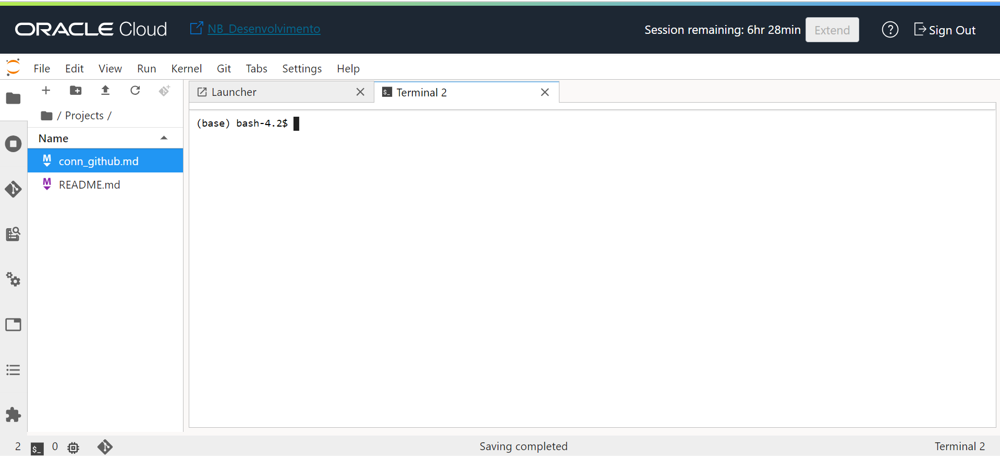
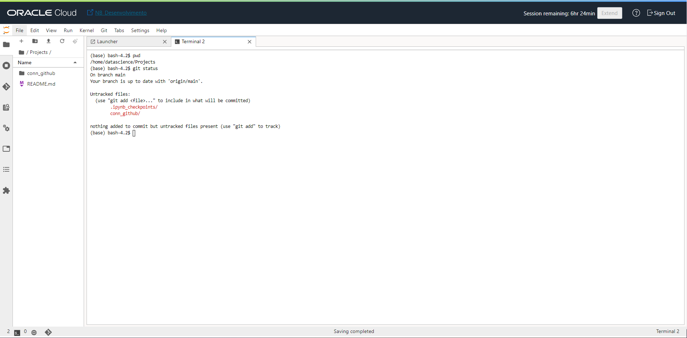
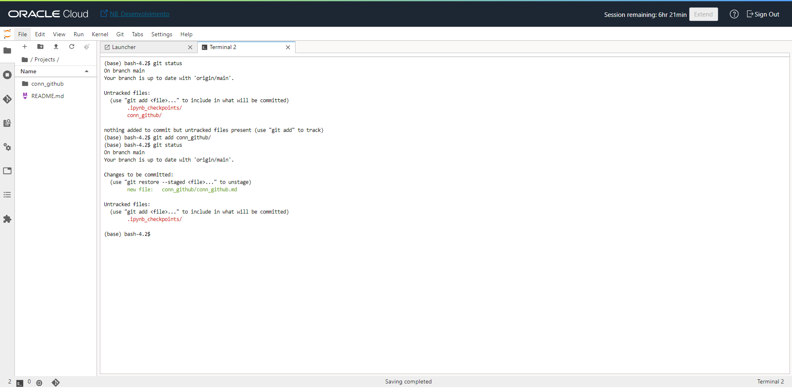
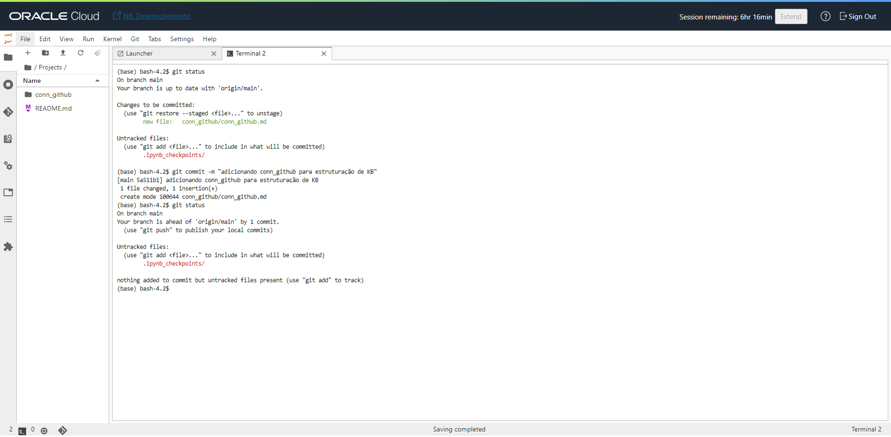
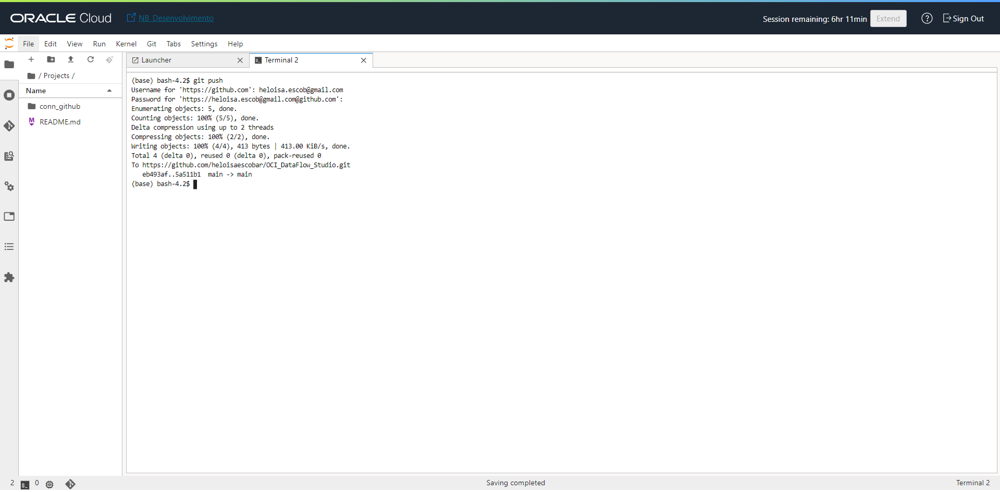

# Adicionando novos Arquivos criados no OCI Data Science ao GitHub

O objetivo dessa página é apoiar na atualização de arquivos e diretórios no GitHub.

Caso ainda você precise criar os artefatos e fazer o primeiro sync, aconselho você seguir o procedimento ["Conectando o OCI Data Science ao GitHub"](conn_github.md)

* Para esse processo, eu criei o **conn_github.md**, conforme imagem representada abaixo:



* Após a criação do arquivo ou diretório, você pode executar o comando abaixo para visualizar os novos arquivos/diretórios identificados:

```
$ git status
```

Abaixo temos a imagem do retorno esperado:



* Agora vamos adicionar os arquivos/diretórios que vamos levar para o github, para isso executar o comando abaixo:

```
$ git add ARQUIVO_QUE_VAMOS ADD
```

Abaixo temos a imagem do retorno esperado:



* Nesse momento, vamos adicionar uma mensagem para realizar o commit. Para isso executar o comando abaixo:

```
$ git commit -a -m "adicionando conn_github para estruturação de KB"
```

Abaixo temos a imagem do retorno esperado:



* Realizando os passos anteriores, podemos enviar as alteração para o github, para isso, vamos executar o comando abaixo:

```
$ git push
```

Abaixo temos a imagem do retorno esperado:




Parabéns, você finalizou o procedimento. Agora você pode consultar seus arquivos no github.