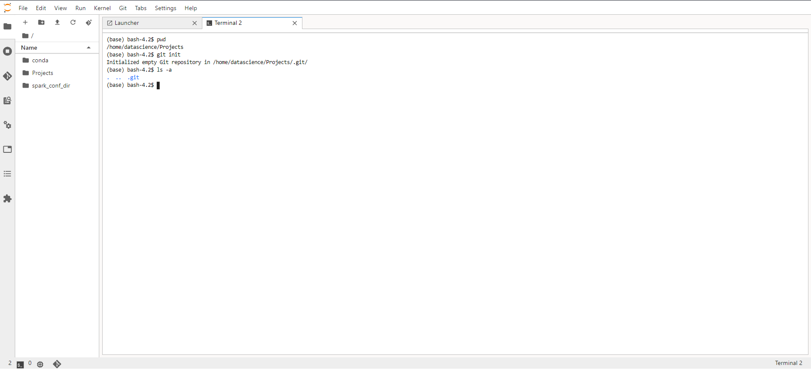
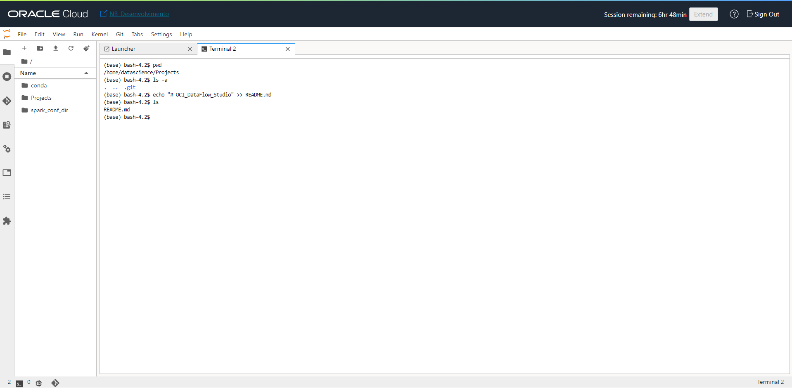
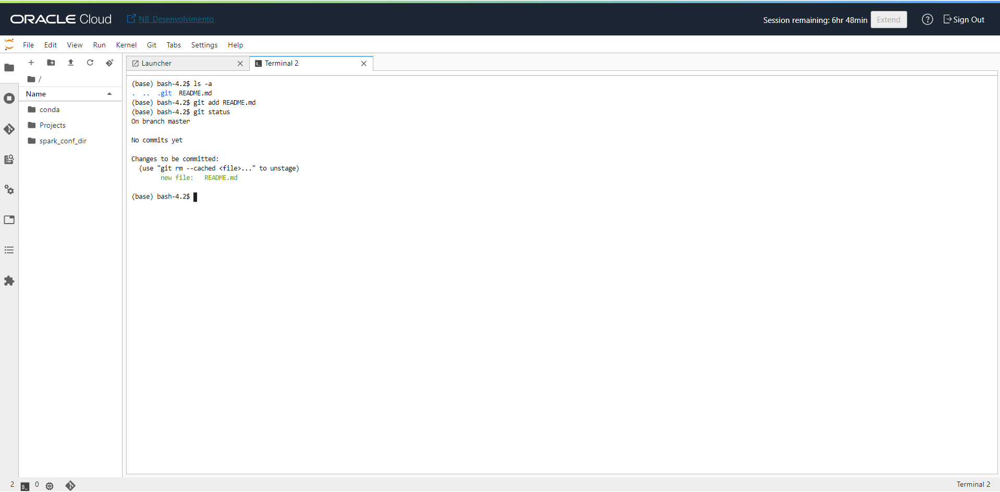
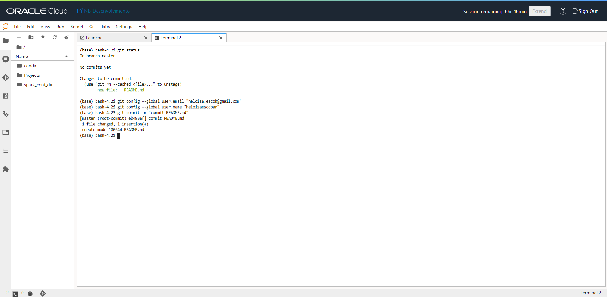
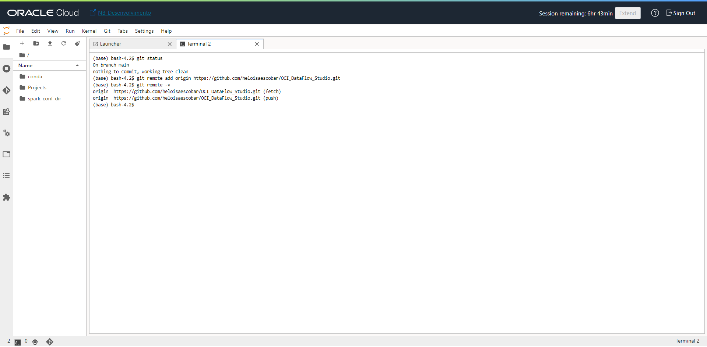
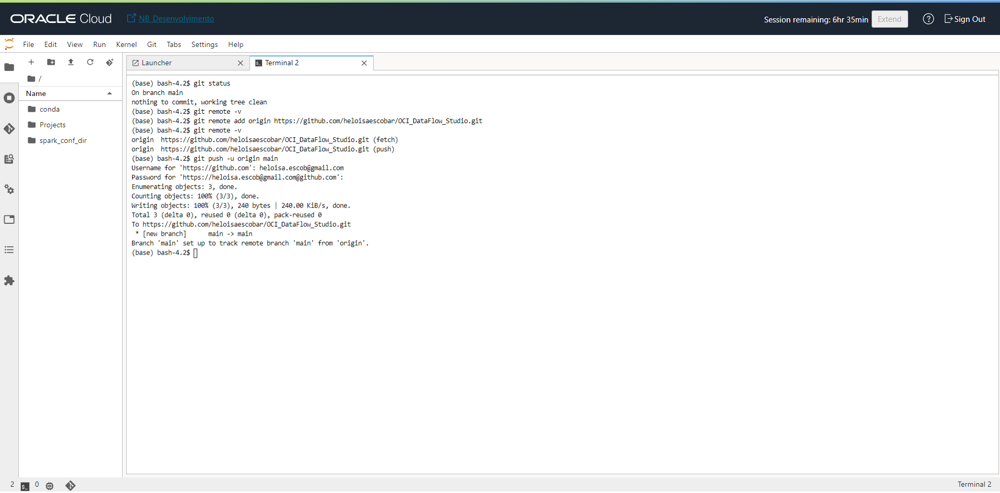

# Conectando o OCI Data Science ao GitHub

O objetivo dessa página é apoiar na conexão e sincronização do OCI Data Science com o Github via comando.

* Primeiramente vamos criar nosso diretório base onde irá armazenar todos os projetos. Após a criação, vamos executar dentro do diretório criado o comando abaixo:

```
$ git init
```

Abaixo temos a imagem do retorno esperado:



Após a execução do commando acima, podemos notar que irá surgir um diretório oculto **.git**.

* Agora vamos criar um arquivo de apoio para realizarmos nosso primeiro commit. Para isso, vamos executar o comando abaixo:

```
$ echo "# OCI_DataFlow_Studio" >> README.md
```

Abaixo temos a imagem do retorno esperado:



Após a execução do commando acima, podemos notar que irá surgir o arquivo **README.md** no diretório local.

* Prontamente, podemos visualizar as alterações que estamos realizando na estrutura atrelada ao git, atráves do comando abaixo:

```
$ git status
```

Abaixo temos a imagem do retorno esperado e podemos notar que temos um novo arquivo que foi criado nos passos anteriores:



* Show! Chegamos em um ponto importante que é começar a preparar o ambiente para levarmos nossas alterações para o github. Lembrando que até o momento todas as alterações que realizamos foi apenas no OCI Data Science. Para isso, vamos executar os comandos abaixo:

```
$ git config --global user.email "SEU_EMAIL_DO_GITHUB"
$ git config --global user.name "SEU_USUARIO_GITHUB"
```

* Após a configuração acima executar mais um comando:

```
$ git commit -m "MENSAGEM DO QUE É SEU COMMIT"
```

Abaixo temos a imagem do retorno esperado:



* Realizamos as configuração e adicionamos a mensagem do que estamos fazendo o commit, agora vamos adicionar a "branch" de origem (Que será nosso github). Para isso executar o comando abaixo:

```
$ git remote add origin https://URL_DO_SEU_REPO
$ git remote -v
```

Abaixo temos a imagem do retorno esperado:



* Chegou o momento esperado, vamos levar o dados efetivamente para o github; Para isso vamos executar o commando abaixo:

```
$ git push -u origin main
```

* Nesse momento a execução do comando anterior está aguardando você passar duas informações importantes **Username** e **Password**. O username será o email que você possui a conta no github e o password será necessário você criar um token. Para gerar o token recomendo você [clicar aqui!](https://docs.github.com/en/authentication/keeping-your-account-and-data-secure/managing-your-personal-access-tokens)


* Criado o token e passado as informações corretamente, você terá abaixo o retorno esperado:




Parabéns você já pode verificar na página do GitHub o arquivo que você publicou!!
